# ZENAMX

ZENAMX是由开源的OpenZen经过大量修改得来，由鸡粑粑修改

> ⚠️ 本仓库**仅供学习与研究目的发布** —— 用于研究客户端侧游戏改造、ASM 字节码补丁和混淆/反混淆技术。在你不拥有的服务器上使用作弊客户端违反绝大多数服务器规则，请自行承担后果。

## 许可
原始混淆字节码未授予任何许可。本仓库中的反混淆产物、构建脚本与文档**仅供研究与学习使用**。如果你是 Zen 的原作者并希望本仓库下架或重新授权，请提 Issues。虽然提了也不会搭理你。

## 截图
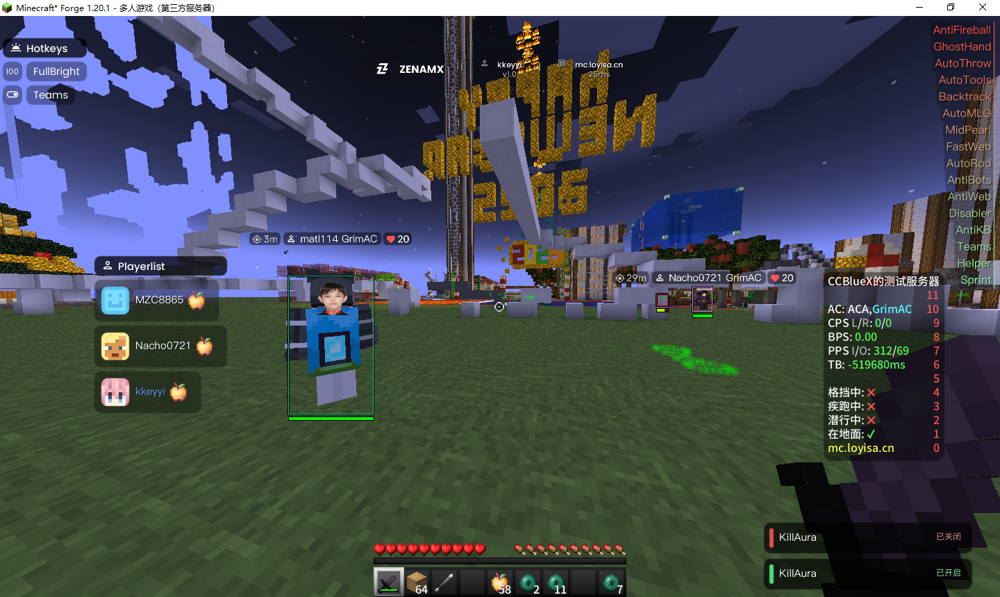

## 精神马来西亚人
或许是由于Zen的作者可能由于常年惨遭家暴，亦可能是由于常年沉迷于米哈游大作导致大脑退化完成义务教育后无法进行进一步的大脑升级。精神马来西亚人不得不前往马来西亚，以进一步大脑升级为高中毕业学历。在精神马来西亚人抵达马来西亚后，精神马来人似乎找到了自己的归宿。

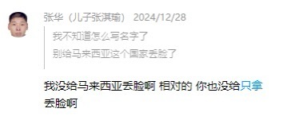

自此，精神马来人正式成为精神马来人。开始称中国人“支那猪”，称中国[“支那”](https://zh.wikipedia.org/wiki/%E6%94%AF%E9%82%A3)。

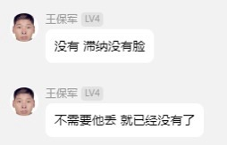


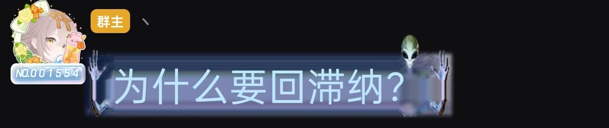

除此之外，精神马来人还会发表更多奇异搞笑言论。当你购买精神马来西亚人的外挂后，你必须要阅读#rules后才可以使用其外挂，其中包括“承认台湾是一个国家”、“承认新疆、西藏、香港、澳门同样都是独立国家”等奇异搞笑言论。因此笔者很难想象其外挂用户的政治立场。

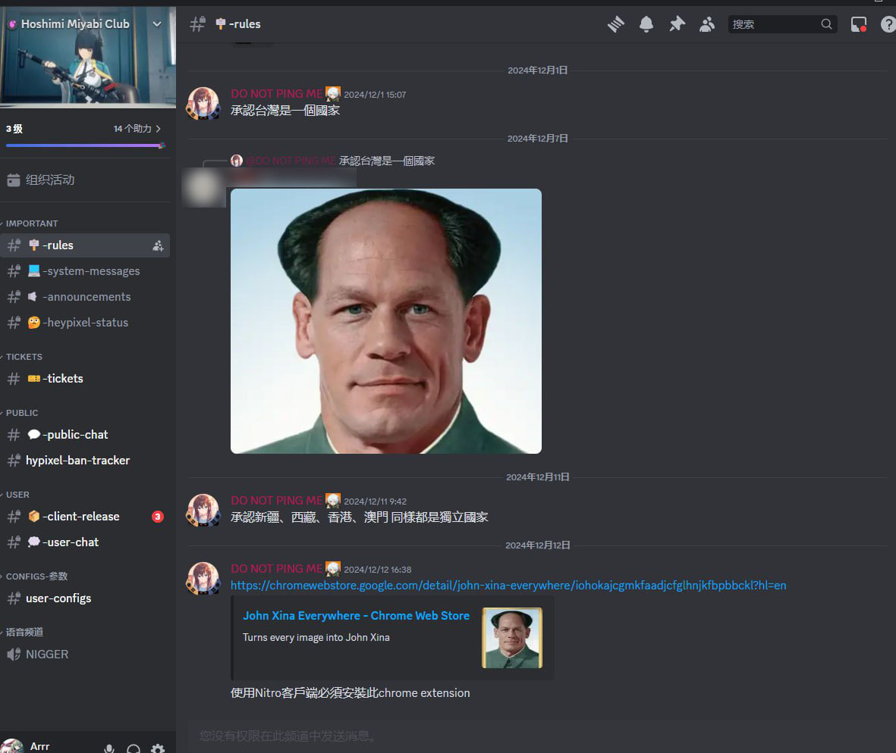

除此之外，精神马来西亚人称惨绝人寰的[南京大屠杀](https://zh.wikipedia.org/wiki/%E5%8D%97%E4%BA%AC%E5%A4%A7%E5%B1%A0%E6%AE%BA)事件**晦气**。

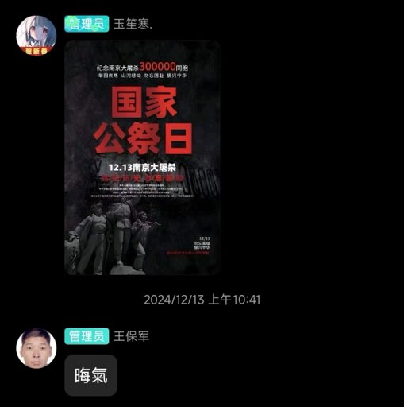

## 开挂死妈
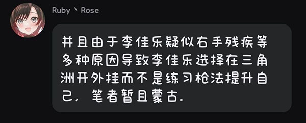

精神马来西亚人认为，笔者在游玩《三角洲行动》时使用了外挂程序是疑似右手残疾的表现，正确的做法是练习枪法。因此使用本项目在《我的世界》中作弊可能会导致右手残疾，在使用本项目进行作弊前，请确认您的右手没有残疾！本项目不会对您的右手残疾付任何责任。

如果您在使用本项目时出现了疑似右手残疾的症状（如右手无力等），请及时关闭键盘声音以避免自己的生物爹对自己进行家暴行为。

[不是我咋掉线了操](./img/不是我咋掉线了操.mp4)

## 我有抑郁症
众所周知，精神马来西亚人患有严重的精神疾病。结合此前精神马来人对其他亲朋好友的倾诉，笔者得知精神马来西亚人曾在群直播自己使用作弊客户端游玩《我的世界》游戏。但是突然下播，在长达半个小时的等待时间后，精神马来西亚人称自己由于键盘声音过大而惨遭家暴。


因此精神马来西亚人长期通过自残、过量使用药物等行为缓解自己长期惨遭家暴的事实。


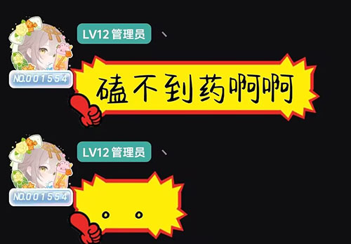

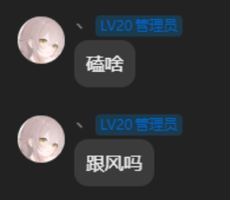

或许是出自自卑， 精神马来西亚人在公开时称嗑药是跟风行为。对于精神马来人对过量使用药物的态度，笔者暂且蒙在鼓里。

## 大孝子
可能由于常年的家暴，导致精神马来西亚人的认知出现了错乱。又或许是长期多次的家暴导致精神马来西亚人患上了[创伤后应激障碍](https://zh.wikipedia.org/wiki/%E5%89%B5%E5%82%B7%E5%BE%8C%E5%A3%93%E5%8A%9B%E7%97%87)，精神马来西亚人认为自己**滚刀爹妈**。笔者尚不明确精神马来西亚人所述的滚刀爹妈是何意味，但是笔者希望精神马来西亚人早日康复。

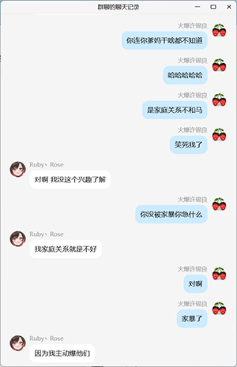
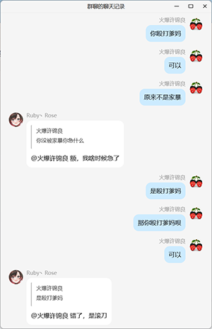
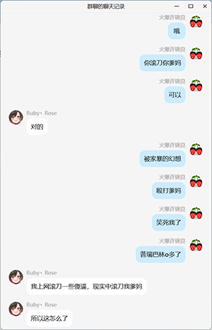


## 发送低保
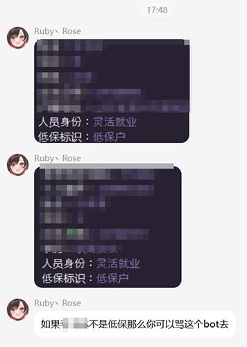

当精神马来西亚人急眼时，将会自动查询你爹妈的户籍并且强制向你爹妈发送两份低保。

尽管[关于印发《山东省最低生活保障管理办法》的通知](http://mzt.shandong.gov.cn/art/2021/9/30/art_15335_10291529.html)明确规定了：

```
第二十三条  家庭财产状况有下列情形之一的，原则上不纳入低保范围：

（一）人均金融资产超过当地年低保标准2倍的；
（二）拥有机动车辆（普通二轮和三轮摩托车、残疾人用于功能型补偿代步的机动车辆除外）、船舶、大型农机具的；
（三）拥有两套及以上住房且住房总面积超过当地住房保障标准面积2倍，或者申请低保之前1年内以及享受低保期间购买超过当地住房保障标准面积商品房的；申请低保之前1年内或者享受低保期间，兴建、购买非居住用房或者高标准装修住房的；
（四）具有投资行为且人均投资数额超过当地年低保标准2倍的；
（五）雇佣他人从事经营性活动的；
（六）实际生活水平明显高于当地低保标准的。

设区的市可根据各自实际和财力条件，对家庭财产状况规定进行细化和调整，增加的支出由当地筹集安排。
```

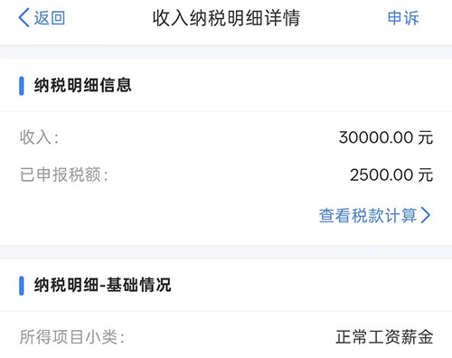

但仅笔者一人，2026年个人所得税申报仅有约四十万人民币，笔者家庭明显符合不纳入低保范围的条件。笔者暂且不清楚精神马来西亚人向笔者全家发送低保的动机，可能是因为精神马来人惨遭家暴精神错乱致使其认为拥有低保是一件非常令人羞耻的事情。笔者建议精神马来西亚人早日纠正错误想法。

## 后门
> 警告！在阅读以下内容时，您可能会感到不适！如有不适，请及时关闭本页面，以避免自己笑出声音而导致惨遭生物爹家暴。

我们在逆向时发现原版Zen存在大量后门，例如上报QQ、屏幕截图、扫描文件、上传文件、远程执行命令等。因此我们**不推荐**任何用户继续使用原版Zen，除非你愿意现在把你身上的衣服脱掉然后去本地人最多的广场裸舞，然后把自己裸舞的视频发送到Zen的群内。

当Zen被注入后，会自动触发截图并上传至服务器。精神马来西亚人回应如下：

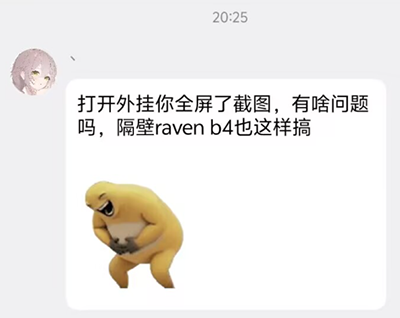

由于精神马来西亚人从小父母双亡，无父无母的精神马来西亚人自幼脑回路不正常。他认为虽然自己没有说自己的外挂会截图，但是由于自己截图，并没有遭到用户反对，所以所有用户都心甘情愿被截图**全屏**并上传到其服务器上。当然不排除所有Zen客户端用户都喜欢把身上的衣服脱掉然后去本地人最多的广场裸舞的可能性。

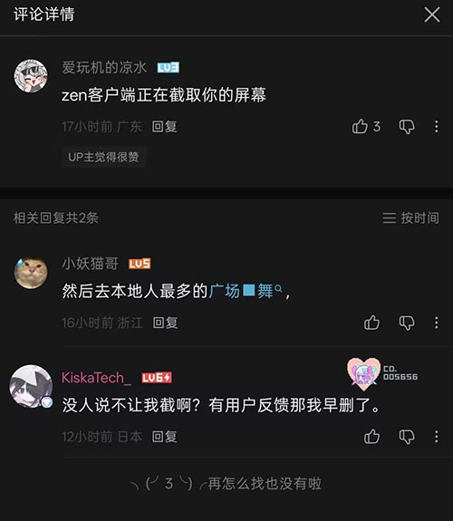

对此，笔者综合精神马来西亚人由于半夜玩电脑惨遭自己生物爹家暴的事实猜测：精神马来西亚人的生物爹和生物妈可能对精神马来西亚人的控制欲极强，因此精神马来西亚人的生活空间内可能存在十万甚至九万个摄像头，对精神马来西亚人的生活进行了无孔不入的监控。因此，精神马来西亚人在拉屎、自慰、睡觉、上课时都时时刻刻被监控，所以自然认为截图用户是正常且合理的行为。

笔者在此提醒：对用户的电脑进行无提醒、未通知用户的全屏幕截图，是不合理的行为。建议精神马来人端正自己对这个世界的认知，从自己过往被家暴经历中走出来，祝你早日康复！

### 分析
当Zen启动时，会自动调用 `iIiIiIiIIIiIiI/Ʊ Đ()Ljava/awt/image/BufferedImage` ([Mapping](./mapping/zen.mapping#L140))，可能由于精神马来西亚人自知是后门，因此精神马来西亚人将此方法严防死守，惨遭没有逼卵子用的Native混淆。

以下是对该方法的Trace。


可见，此方法调用了 `java/awt/Robot;createScreenCapture(Ljava/awt/Rectangle)`，会将用户的**全屏**截图后返回。

继续向下追踪，发现其新建了 `iIiIiIiIIIiIiI/ɿ` (`CPacketSystemInfo`) ([Mapping](./mapping/zen.mapping#L2552)) 对象，我们对该类反编译，发现精神马来西亚人妈妈死掉了所以忘记删除Lombok自动生成的`@ToString`方法，因此惨遭Claude还原。

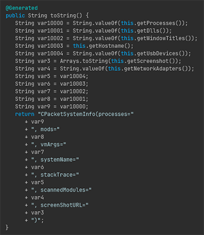

此包会上传用户处理器信息、模组列表、虚拟机参数、系统名称、上报截图等信息，但笔者认为除截图外，其他信息收集在**提前告知用户的前提下**是合理的，因此并无不妥。虽然精神马来西亚人没有提前告知用户。

随后，笔者继续分析。由于该类继承了 `iIiIiIiIIIiIiI/ɰ` (`Packet`) ([Mapping](./mapping/zen.mapping#L2459))，我们分析了所有该类的子类。

遗憾的是，其他类由于没有添加 Lombok 标识，我们不得不通过其他方式 Trace 这些类的具体用途。经过我们不懈努力的调试和追踪，我们还原出了我们认为可疑的部分行为。

- 远程命令执行 `iIiIiIiIIIiIiI/ʔ`
- 远程文件下发 `iIiIiIiIIIiIiI/ʏ`
- 远程文件浏览 `iIiIiIiIIIiIiI/ʑ`

*以上不是全部*

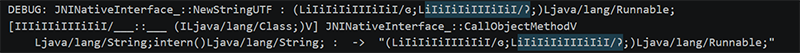

对于这些后门，精神马来西亚人作此解释。

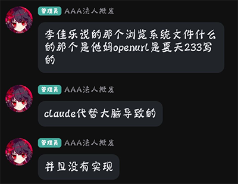

精神马来西亚人称这些后门全部都是由**夏天233**制造，并非自己。并且这些后门并没有实现，所以可能是由于精神马来西亚人产生幻觉导致笔者抓到了Trace。而且并不能解释同是一套Network系统，为什么上传截图包实现了但其他方法没有实现。

其后其在[视频](https://www.bilibili.com/video/BV147L86TEEZ)中表示，是服务器在迁移时没有实现，而不是客户端没有实现。同时，精神马来西亚人在视频中表示*没有功能*，但是在QQ群中表示*是夏天233写的*。

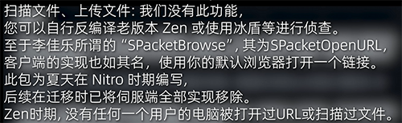

由于精神马来西亚人嘴硬，所以到底具体有没有实现，笔者暂且蒙古。

### 父子相爱相杀


在很久之前，作为知名野狗的许锦良曾对精神马来西亚人进行过攻击：许锦良认为精神马来西亚人是他儿子，去日本是为了成为慰安妇，抚平自己被家暴的过去。

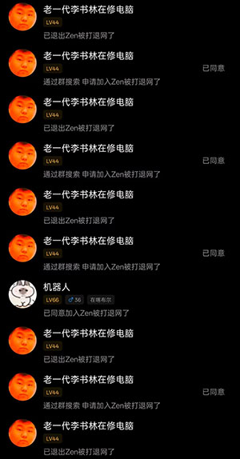

但很明显，在本项目发布后，许锦良对OpenZen交流群创下了高达十进十出的历史记录。笔者在此猜测，精神马来西亚人曾因为自己半夜玩电脑由于敲键盘声音过大惨遭家暴的事情中迟迟无法走出阴影，因此自小时便缺失来自生物爹的父爱。而许锦良称精神马来西亚人为儿子，因此刚好补上了自己缺失的父爱这一块，私下便偷偷称许锦良为自己的父亲。自始，二人幸终。

笔者在惨遭许锦良十进十出狗叫时，认为许锦良可能已经完成[前脑叶白质切除术](https://zh.wikipedia.org/wiki/%E8%84%91%E7%99%BD%E8%B4%A8%E5%88%87%E9%99%A4%E6%9C%AF)，许锦良坚持认为两张照片是同一个人，对此许锦良掏出了以下证据：

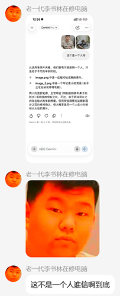

由此可见，许锦良并没有思考的能力，结合自己亲儿子精神马来西亚人患有多种精神疾病的事实与精神马来西亚人认为Telegram查询机器人的事实，证实了笔者在前提到的前脑叶白质切除术。笔者在此希望许锦良父子能够早日康复。

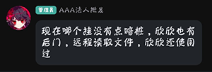

但精神马来西亚人在QQ群中指出，欣欣使用过外挂后门远程读取他人文件。不知作为德州骡子的许锦良见自己的亲生儿子如此指认自己作何感想。

## 抄袭
此项目大部分功能模块几乎全部抄袭自Naven客户端，具体详见以下分析。

[详细分析](./paste/README.md)

## 致谢

- 原始混淆客户端：**Zen**。
- 反混淆、符号还原与工程脚手架：**Claude** 在人工监督下完成。
- [Java Deobfuscator](https://github.com/java-deobfuscator/deobfuscator)
- 从古墓中挖出的 [Themida](https://www.oreans.com/Themida.php)
- 惨遭魔改的 [Zelix](https://www.zelix.com/)
- [Enigma MCP](https://github.com/Margele/Enigma-MCP)
